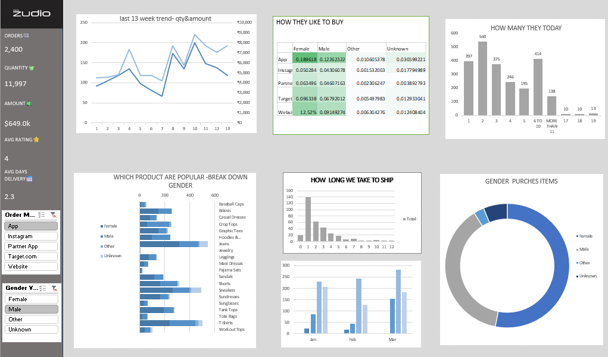

# Zudio Sales Analytics Dashboard
## Project Overview
This project presents an interactive Excel dashboard developed to analyze Zudio retail sales performance and customer purchasing behavior.
The dashboard provides insights into:
- Total Orders
- Quantity Sold
- Revenue Generated
- Average Rating
- Delivery Performance
- Customer Purchase Channels
- Gender-wise Purchases
- Product Popularity Analysis
- Weekly Sales Trends
---
## Dashboard KPIs
| KPI | Value |
|------|--------|
| Orders | 2,400 |
| Quantity Sold | 11,997 |
| Revenue | ₹649K |
| Average Rating | 4 |
| Average Delivery Time | 2.3 Days |
---
## Key Insights
### Customer Purchase Channels
Customers purchase products through:
- App
- Instagram
- Partner App
- Target.com
- Website
### Product Analysis
Popular products include:
- T-Shirts
- Jeans
- Shorts
- Hoodies
- Dresses
- Accessories
### Customer Segmentation
Analysis is performed based on:
- Female
- Male
- Other
- Unknown
### Delivery Analysis
Most orders are delivered within 1–3 days.
---
## Tools Used
- Microsoft Excel
- Pivot Tables
- Pivot Charts
- Slicers
- Conditional Formatting
- Data Cleaning
---
## Files Included
| File | Description |
|--------|-------------|
| Zudio_Dashboard.xlsx | Interactive Excel Dashboard |
| zudio_sales_data.xlsx | Source Dataset |
| dashboard_preview.png | Dashboard Screenshot |
| Project_Report.pdf | Project Documentation |
---
## Dashboard Preview

## Project Overview
Interactive Excel dashboard analyzing:
- Sales Performance
- Customer Behavior
- Product Popularity
- Delivery Metrics
- Gender-wise Purchases
## Author
Bhanu Prakash

 
